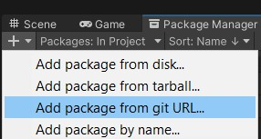

# SolARCloud Package Documentation

## How to import the package

From the Unity Package Manager, select _Add package from git URL..._

Enter this repository's URL [https://github.com/SolarFramework/SolARCloudUnityPackage.git](https://github.com/SolarFramework/SolARCloudUnityPackage.git) and click _Add_.

## SolARCloud Application Development

### On HoloLens 2

TODO

### On ARKit/ARCore

TODO
